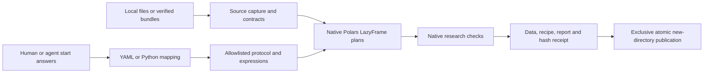

# Architecture

Wrangle observes and prepares local scientific tables. Its public recipe API is
`inspect(source)` and `prepare(sources, recipe)`; the CLI calls the same engine.
Guided `start` observes files and records supplied choices, then emits an ordinary
YAML protocol. It never executes preparation or selects scientific meaning.

| Responsibility | Exact implementation |
| --- | --- |
| Public API, preparation and receipt orchestration | `_api.py:inspect,prepare,Prepared` |
| CLI invocation and human questions | `_cli.py:main` |
| Guided intent, completeness and publication | `_start.py:draft,validate_decisions,publish` |
| Strict YAML and mapping grammar | `_protocol.py:load_recipe,normalize_recipe,dump_recipe` |
| Local formats, snapshots and parent-bundle validation | `_sources.py:read_source` |
| Native table/type/callback boundary | `_core.py:frame,require_native` |
| Operation dispatch and observation transitions | `_execution.py` |
| Scientific expression, field, join, table and statistics operations | `_recipe_expressions.py`, `_recipe_fields.py`, `_recipe_join.py`, `_recipe_tables.py`, `_recipe_statistics.py` |
| Native output invariants | `_contracts.py` |
| Disk snapshots, scalar checks, evidence and verified reuse | `_storage.py:DiskWorkspace` |
| Exclusive atomic final publication | `_publication.py:publish_directory` |
| Human text and escaped notebook HTML | `_presentation.py` |
| Generated capability navigation and failure definitions | `_catalog.py:catalog,operation_document` |

Paths are relative to `Path(wrangle.__file__).parent`. Read [the recipe manual](recipes.md)
and a compact `docs/operations/<name>.json` for the contract of a particular operation.
Definitions produce the shipped catalog; executable workflows assert expected
values, exclusions and evidence from the installed wheel.

## Execution and state

Memory execution collects captured tables and intermediates. Disk execution
copies raw input files, writes immutable Parquet checkpoints, checks native plans,
hashes logical values incrementally and retains complete exclusion/identity
artifacts. It requires an output directory and returns a LazyFrame scanning the
verified result. Stateful Polars operations can still need substantial RAM;
inspection and guided start are currently eager.

Input keys, physical units and parent declarations constrain each operation.
Loss requires a reason, expansion requires explicit permission and a checked
output identity, and matching requires declared cardinality and order. Reference
statistics can be frozen in a receipt and reused instead of fitted again.

Source snapshots and normalized protocol values determine the recorded evidence.
Publication occurs only after checks; output directories are never overwritten.
Receipt and report integrity are rechecked on reuse. Python manages orchestration,
file I/O and hashes; Polars performs data transformations and dataset checks.

Read [security requirements](security.md), [the assurance case](security/assurance.md)
and [release verification](security/releases.md) for the trust model and limits.
